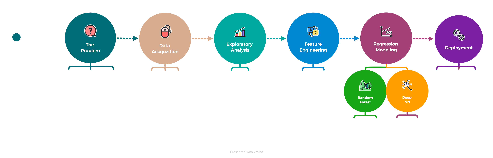

# **Predicting market price of used Cars**
---

## **The Problem**
 
According to a recent study by AutoTrader.ca, 7 in 10 Canadians buy at least 4 cars in their lifetime. From this demographic, only 2 in 10 know the car buying process through and through, and 44% need help comparing and determining if they are getting a good price deal. While these are experienced buyers, there remains room for improvement to provide them with more resources and education for novice and experienced buyers.

It is in the interest of consumers to predict resale value with a certain degree of accuracy as a basis of their negotiations.
  
 

## **The Opportunity**
 
According to Statistica.com, used car retail sales have more than doubled since 2012, when sales amounted to just six billion to 15.34 billion Canadian dollars in 2021. This has been mainly due to the rise in online marketplaces like Kijiji, Facebook, and Autotrader. According to Autotrader.ca, 8 in 10 Canadian consumers search for cars on online automotive marketplaces. Buying a used car is always seen as a cost-saving strategy that can offer significant advantages over buying a new car, including lower costs, reliability, insurance costs, and a more comprehensive selection. It is, therefore, clear that the price prediction of used cars has a high commercial value in an industry with such evaluation.
  
 

## **The Data Science**
Predicting a used car's resale value is challenging for a novice buyer. The value of a car depends on many factors, including the year of manufacturer, model, mileage, horsepower, origin, and several other specific information such as type of fuel and braking system, condition of bodywork and interiors, interior materials (plastics of leather), safety index, type of transmission (manual, assisted, automatic, semi-automatic), number of doors, number of previous owners if it was previously owned by a private individual or by a company and the prestige of the manufacturer. 

But by leveraging the help of cutting-edge data science tools, we can harness the volume, value, variety, velocity, and veracity of online automotive marketplace data to build a predictive algorithm to solve this problem. A visual step of this process can be seen below. 

## **Goals & Objectives**
  
 

## **Process**
  
 

<be>
 

### **Data accquzition.**
The first 'V' of big data plays a crucial role in building a predictive model of good accuracy. I crawled the most popular online automotive marketplace — Kijiji.ca, and scrapped 400K listings across Canada using Python. This data was collected for two weeks, cleaned, and stored in a SQL database. 
  
 

### **Data Wrangling and Exploratory Analysis.**
The second 'V,' from the perspective of this project, is the most important. The dataset was analyzed to discover insight and recognize patterns leading to more effective and accurate models. Using Python, Matplotlib, and ggplot2, I explored the price variable to determine the skewness and kurtosis of the distribution. Next, I plotted graphs to observe it's relationship with numerical and categorical features. Finally, explored the data for correlations and feature importances and discovered patterns affecting price. 
 
 

### **Data Processing.** 
It was necessary to perform preprocessing to minimize the probability of incorrect learning by the models. Outliers and observations that weren't imputable were removed. I filtered the dataset to leave out cars with salvage, parts-only titles. Further, I filtered out cars with odometer readings above 300K and years of manufacture greater than 1956. 
The distribution was then normalized. It's important to note that transformations such as scaling and encoding were done inside a pipeline. 
 
 

### **Regression Modeling.**
A baseline of different models was built and compared. The best-performing model was selected for further tuning and hyperparameter optimization. A random forest model performed best with a mean of 84% accuracy with cross-validation. 
The table below depicts experimental results by model. 
 
 

### **Optimization.**
Using Scikit learns Grid search with cross-validation. A random forest model was tuned and optimized, boosting mean accuracy by 2%. Following the feature importance computed with K=5 KFold Cross Validation, scores on the hold-out test set and the final RMSE computed on the entire dataset.
 
 

### **Deep Neural Network.**
A Neural Network was built using the TensorFlow Keras library. The model is an 8-layered network with 6 hidden layers. The activation functions used were Relu and LeakyRelu optimized using Adam optimizer. The training was done for 300 epochs with a batch size of 64 and two fits per each epoch with cross-validation. A hold-out sample was used to evaluate the model for its accuracy. The final model was saved using a pickle. 
 
 

### **Deployment.** 
Using Python and Flask. I coded an API prediction script that takes in the values of features of a car and creates a prediction based on the data. This was tested using Postman was JSON data on a local machine before it could be deployed on Amazon Web Services. 

Using Jinja 2 for Flask, I coded an HTML webpage containing a web form in a GUI interface. The flask script interacts with the form to extract data in a JSON format, makes a prediction, and returns the prediction to the user in the GUI. The model can be seen below. 

With everything working on my local machine, the project was deployed on the cloud for production.
 
 

## **Reflections:**

